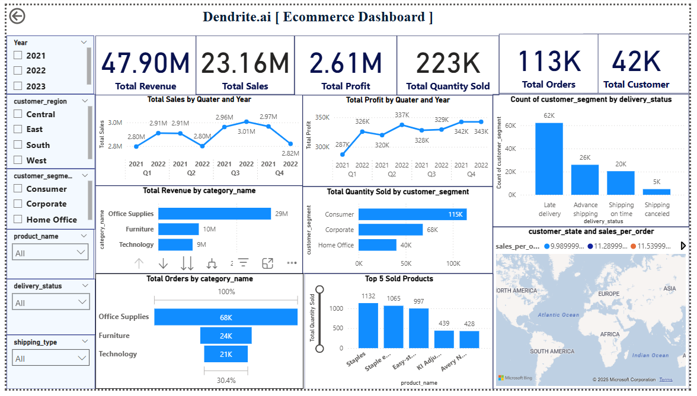

# 🛒 ecommerce-dashboard-powerbi

An interactive and visually rich **Power BI dashboard** that provides a comprehensive view of an ecommerce company’s performance across 🛍️ sales, 👥 customers, 📦 products, 🌍 geography, and 🚚 delivery insights from **2021 to 2023**.

This project demonstrates my skills in **data analysis**, **business intelligence**, and **visual storytelling** using Microsoft Power BI.

---

## 📸 Dashboard Preview

  
*A snapshot of the final dashboard created in Power BI Desktop.*

---

## 📊 Key Metrics & Visuals

| 📌 Metric               | 📈 Value     |
|-------------------------|-------------|
| 💰 Total Revenue         | **47.90M**  |
| 🛍️ Total Sales           | **23.16M**  |
| 📈 Total Profit          | **2.61M**   |
| 📦 Quantity Sold         | **223K**    |
| 🧾 Total Orders          | **113K**    |
| 👥 Total Customers       | **42K**     |

---

## 🔍 Core Insights from Dashboard

1. **📆 Year-over-Year Growth**  
   ↪ A steady upward trend in **sales**, **profit**, and **quantity sold** between 2021 and 2023.

2. **🗺️ Regional Performance**  
   ↪ The **Central** region leads in overall performance, with strong metrics across all KPIs.

3. **👥 Customer Segment Analysis**  
   - **Corporate** customers drive the highest **profit & revenue**.  
   - **Consumers** lead in **total product quantity sold**.

4. **📦 Product Category Performance**  
   - **Office Supplies** dominate in total sales and volume.  
   - **Top 5 Products** include **Staplers**, **Storage Units**, and **Paper**.

5. **🚚 Delivery Status Overview**  
   - Majority of deliveries are **on-time**, followed by **advance shipping**.  
   - **Late or canceled shipments** are minimal.

6. **🌍 Geo Insights**  
   - Map visuals highlight strong sales in **Mexico**, making it a key region for expansion or targeting.

---

## 🎯 Features

- ✅ Dynamic filters for Year, Region, Segment, Category, Delivery
- 📈 KPI Cards for real-time performance monitoring
- 📊 Bar & column charts to analyze products and segments
- 🌍 Geo map for regional performance visualization
- 🧭 Time-based trend lines (quarterly/yearly)
- 🧩 Drill-down capabilities with interactive slicers

---

## 🛠️ Tech Stack

| ⚙️ Tool          | 📝 Purpose                            |
|------------------|----------------------------------------|
| **Power BI**     | Dashboard creation & data visualization |
| **Excel**        | Data cleaning, formatting & filtering   |

---

---

## 🚀 How to Run

1. **Install Power BI Desktop** 👉 [Download Here](https://powerbi.microsoft.com/desktop/)
2. Clone this repository:
   ```bash
   git clone https://github.com/sakshis19/ecommerce-dashboard-powerbi.git

